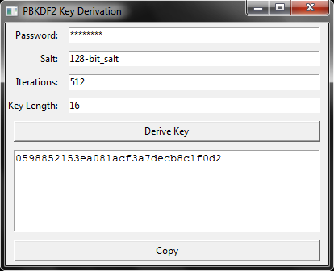

# pbkdf2
PBKDF2 Function GUI in Pure TCL/TK and Autoit3

<div align="center">
 
</div>

## PHP compliant
```php
<?php
$password = "password123";
$salt = "somesalt";
$iterations = 1000;
$keyLength = 32; // Key length in bytes
$algorithm = "sha256";

$derivedKey = hash_pbkdf2($algorithm, $password, $salt, $iterations, $keyLength, true);

// Convert derived key to hexadecimal representation
$derivedKeyHex = bin2hex($derivedKey);

echo "PBKDF2 Password Hash: $derivedKeyHex";
?>
```
